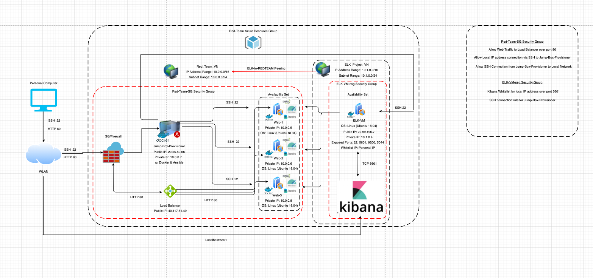

## Automated ELK Stack Deployment

The files in this repository were used to configure the network depicted below. 

These files have been tested and used to generate a live ELK deployment on Azure. They can be used to either recreate the entire deployment pictured above. Alternatively, select portions of the  file may be used to install only certain pieces of it, such as Filebeat.

This document contains the following details:
- Description of the Topology
- Access Policies
- ELK Configuration
- Beats in Use
- Machines Being Monitored
- How to Use the Ansible Build

### Description of the Topology

The main purpose of this network is to expose a load-balanced and monitored instance of DVWA, the D*mn Vulnerable Web Application.

Load balancing ensures that the application will be highly available, in addition to restricting access to the network from unwanted guests.

Load balancers protect the availability of a given network by providing the webservers an external IP address that is accessed by the internet. As traffic enters the network, the load balancer will distribute the incoming traffic evenly across the multiple servers. This is advantageous in many ways, but serves the primary purpose of mitigating DoS (Denial of Service) attacks due to overwhelming web traffic. 

A load balancer will also typically have a health probe function that will regularly check available machines to ensure they are functioning correctly before sending traffic to them. If there is a problem with a given machine, the load balancer will stop sending traffic to the machine and will issue a reported error. This will not completely protect a system, but will add to it's resiliancy.   

Integrating an ELK server allows users to easily monitor the vulnerable VMs for changes to the event logs and system metrics. In this instance, we have utilized two tools from the Elastic Stack library: Filebeat and Metricbeat.

- FileBeat collects logs about the file system. It is particularly useful for system and application log files, but can be used for text files that you would like to index to Elasticsearch in some way.

- Metricbeat collects machine metrics such as uptime from servers and systems. It's lightweight platform allows us to send system and service statistics without impacting system or application performance.  

The configuration details of each machine may be found below.

| Name     | Function   | IP Address | Operating System |
|----------|------------|------------|------------------|
| Jump Box | Gateway    | 10.0.0.7   | Linux   Ubuntu   |
| Web-1    | Web Server | 10.0.0.5   | Linux   Ubuntu   |
| Web-2    | Web Server | 10.0.0.6   | Linux   Ubuntu   |
| Web-3    | Web Server | 10.0.0.8   | Linux   Ubuntu   |
| ELK-VM   | Log Server | 10.1.0.4   | Linux   Ubuntu   |

### Access Policies

The machines on the internal network are not exposed to the public internet. 

Only the Jump-Box-Provisioner can accept connections from the internet. Access to this machine is only allowed from the following IP addresses:

- Whitelisted IP Address: Personal IP

Machines within the network can only be accessed by the Jump-Box-Provisioner utilizing SSH (Secure Shell).

The Jump-Box-Provisioner Machine is allowed to access the ELK-VM through the docker container. However, my personal computer is allowed to connect to Kibana through the web browser on port 5601.

A summary of the access policies in place can be found in the table below.

| Name          | Publicly Accessible | Allowed IP Addresses          |
|---------------|---------------------|-------------------------------|
| Load Balancer | Yes                 | Personal/Open                 |
| Jump Box      | Yes                 | Personal                      |
| Web-1         | No                  | 10.0.0.7                      |
| Web-2         | No                  | 10.0.0.7                      |
| Web-3         | No                  | 10.0.0.7                      |
| ELK-VM        | Yes                 | 10.0.0.{8,7,5,6}/local IP:5601|

### Elk Configuration

Ansible was used to automate configuration of the ELK machine. No configuration was performed manually, which is advantageous because any network administrator can implement these changes/additions across multiple machines within a given network. They can modify the playbook to their specific needs before deployment which allows this method to be scalable, repeatable, and empiracle. 

When a particular piece of infrastructure is desired, all that is required in the future is the code that defines that particular item and deployment will be simple. This will also allow for security protocols to be be built from the ground up and facilitate simple logging and version control. Ultimately, the main purpose of this infrastructure is to implement Continuous Integration/Continuous Deployment '(CI/CD)' to our virtual environment through updates within our configuration files rather than one-to-one machine interaction/maintenance.

### Target Machines & Beats

This ELK server is configured to monitor the following machines:
- Web-1 10.0.0.5
- Web-2 10.0.0.6
- Web-3 10.0.0.8

We have installed the following Beats on these machines:
- Filebeat
- MetricBeat

These Beats allow us to collect the following information from each machine:

- Filebeat organizes log information pertaining to the file system on a given machine and sends the results to Logstash and Elasticsearch. This allows us to reduce the amount of logs pulled and monitor specifically when files are changed.
  - Example: agent.type: filebeat log.file.path: /var/log/syslog

- MetricBeat organizes log information pertaining to the machine metrics and sends the results to Logstash and Elasticsearch. This allows us to further understand how much work the machines are doing and monitor/prevent instances in which excessive CPU usage may become an issue.
  - Example: service.type: Docker service.address: /var/run/docker.sock 

### Playbook Overview

The playbook implements the following tasks:
- Increases the Virtual Memory of the Machne
- Commands the System to utilize the Increase in Memory
- Installs and Enables Docker 
- Installs Python and Enables it's Docker Module
- Initiates the ELK Stack Docker Container on Reboot 

The following screenshot displays the result of running `docker ps` after successfully configuring the ELK instance.

### Using the Playbook
In order to use the playbook, you will need to have an Ansible control node already configured. Assuming you have such a control node provisioned: 

SSH into the control node and follow the steps below:
- Copy the `Filebeat-config.yml` file to Web VM's using `etc/filebeat/filebeat-playbook.yml.`
- Update the `Filebeat-config.yml` file to include IP Address of the ELK Machine.
- Run the playbook, and navigate to the Filebeat installation page on the ELK Server GUI to check that the   installation worked as expected.

- Which file is the playbook? Where do you copy it?
  _`Filebeat-playbook.yml.` needs to be copied `/etc/ansible/roles/`_

- Which file do you update to make Ansible run the playbook on a specific machine? How do I specify which machine to install the ELK server on versus which to install Filebeat on?

  _Update the `hosts` option near the top of the `filebeat-playbook.yml` as either `web servers` or `elk`._

- Which URL do you navigate to in order to check that the ELK server is running?

  _Navigate to http://{ELK Public IP]:5601/app/kibana._

_As a **Bonus**, provide the specific commands the user will need to run to download the playbook, update the files, etc._
